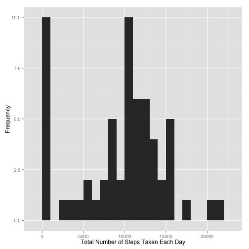
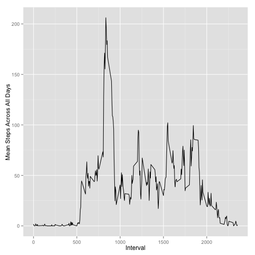
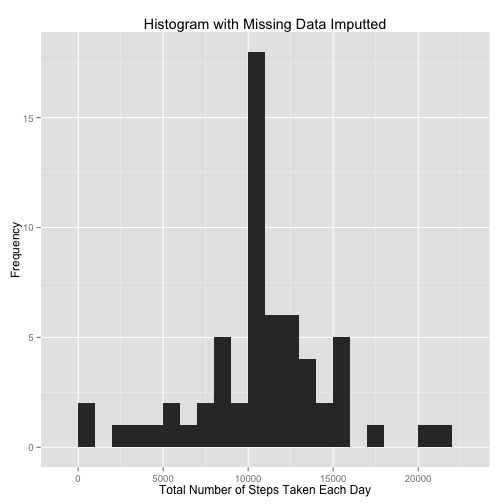

# Reproducible Research: Peer Assessment 1

```r
library(dplyr, warn.conflicts=FALSE)
library(ggplot2)
library(xtable)
pprint <- function(x, ...) format(x, big.mark=",", ...)
```

## Loading and preprocessing the data

```r
unzip('activity.zip', overwrite=TRUE)
df <- read.csv('activity.csv', stringsAsFactors=FALSE)
```

## What is mean total number of steps taken per day?

```r
by.date <- group_by(df, date)
total.by.date <- summarize(by.date, steps=sum(steps, na.rm=TRUE))
qplot(x=total.by.date$steps, geom="histogram",
      xlab="Total Number of Steps Taken Each Day",
      ylab="Frequency",
      binwidth=1000)
```

 

```r
mean.steps.per.day = mean(total.by.date$steps, na.rm=TRUE)
median.steps.per.day = median(total.by.date$steps, na.rm=TRUE)
c(mean.steps.per.day, median.steps.per.day)
```

```
## [1]  9354 10395
```

The data has a 9,354 mean total number of steps each day while
having a 10,395 median total number of steps each day.

## What is the average daily activity pattern?

```r
by.interval <- group_by(df, interval)
average.by.interval <- summarize(by.interval, steps=mean(steps, na.rm=TRUE))
qplot(x=interval, y=steps, data=average.by.interval,
      geom="line",
      xlab="Interval",
      ylab="Mean Steps Across All Days")
```

 

```r
max.average <- max(average.by.interval$steps)
max.average.interval = average.by.interval[max.average,
                                           'interval']
c(max.average, max.average.interval)
```

```
## [1]  206.2 1705.0
```
The 1,705 5-minute interval has the maximum average steps
at 206.2.

## Imputing missing values


```r
table.na.values <- table(is.na(df$steps))
table.na.values
```

```
## 
## FALSE  TRUE 
## 15264  2304
```
There are 2,304 rows with missing step data, out of
17,568 rows.

### Strategy For Imputing Missing Data
I compare the variances of steps among intervals in each day versus the
variance of steps among days for each interval to determine the strategy
for imputting missing values.


```r
avg.sd.by.date <- mean(summarize(group_by(df, date),
                                 sd=sd(steps, na.rm=TRUE))$sd,
                       na.rm=TRUE)
avg.sd.by.interval <- mean(summarize(group_by(df, interval),
                                     sd=sd(steps, na.rm=TRUE))$sd,
                           na.rm=TRUE)
c(avg.sd.by.date, avg.sd.by.interval)
```

```
## [1] 105.12  82.98
```
I impute the value for missing steps by using the mean steps across
all non-missing rows with the same interval.  This utilizes the analysis
from the data that shows the standard deviations for same-interval steps
(82.980) is lower than
the standard deviations for same-day steps
(105.122), under the assumption
that a lower standard deviation would
be better representative for imputting missing data.

### Replace Missing Values With Interval Averages

```r
df.imputted <- merge(df, average.by.interval, by="interval",
                     suffixes=c(".original", ".interval.average"))
df.imputted$steps <- apply(df.imputted, 1,
                           function(row) {
                               if (is.na(row['steps.original'])) {
                                   return (row['steps.interval.average'])
                               } else {
                                   return (row['steps.original'])
                               }
                           })
df.imputted$steps <- as.numeric(df.imputted$steps)
total.by.date.imputted <- summarize(group_by(df.imputted, date),
                                    steps=sum(steps, na.rm=FALSE))
qplot(x=steps, data=total.by.date.imputted,
      geom="histogram",
      xlab="Total Number of Steps Taken Each Day",
      ylab="Frequency",
      main="Histogram with Missing Data Imputted",
      binwidth=1000)
```

 

```r
mean.steps.per.day.imputted <- mean(total.by.date.imputted$steps, na.rm=FALSE)
median.steps.per.day.imputted <- median(total.by.date.imputted$steps, na.rm=FALSE)
c(mean.steps.per.day.imputted, median.steps.per.day.imputted)
```

```
## [1] 10766 10766
```

The data with missing values imputted has a 10,766
mean total number of steps each day while having a
10,766 median total number of steps each day.


```r
stats.before.after <- data.frame(original=c(mean.steps.per.day,
                                            median.steps.per.day),
                                 after.imputting=c(mean.steps.per.day.imputted,
                                                   median.steps.per.day.imputted),
                                 row.names=c("Mean", "Median"))
```

```r
print(xtable(pprint(stats.before.after)), type="html")
```

<!-- html table generated in R 3.1.0 by xtable 1.7-3 package -->
<!-- Mon Aug 11 22:55:44 2014 -->
<TABLE border=1>
<TR> <TH>  </TH> <TH> original </TH> <TH> after.imputting </TH>  </TR>
  <TR> <TD align="right"> Mean </TD> <TD>  9,354 </TD> <TD> 10,766 </TD> </TR>
  <TR> <TD align="right"> Median </TD> <TD> 10,395 </TD> <TD> 10,766 </TD> </TR>
   </TABLE>
It appears that imputting the missing values increased both the mean and median
total number of steps per day, which is logical, as missing values
are equivalent to zero values for total metrics (e.g., total per day).
This also appears to have deskewed
the data as the mean and median are now equivalent.

## Are there differences in activity patterns between weekdays and weekends?

```r
df.imputted$day.of.week <- strftime(strptime(df.imputted$date,
                                             '%Y-%m-%d'),
                                    '%a')
df.imputted$part.of.week <- sapply(df.imputted$day.of.week,
                                   function(x) ifelse(substr(x, 1, 1) == 'S',
                                                      "weekend",
                                                      "weekday"))
df.imputted$part.of.week <- as.factor(df.imputted$part.of.week)
class(df.imputted$part.of.week)
```

```
## [1] "factor"
```

```r
avg.by.interval.part.of.week <-
    summarize(group_by(df.imputted, interval, part.of.week),
              steps=mean(steps, na.rm=FALSE))
qplot(x=interval, y=steps, data=avg.by.interval.part.of.week, geom="line",
      facets=part.of.week~.)
```

 

There is a clear difference in the activity pattern between weekdays and
weekends, where weekdays have a significant spike in the morning compared
to the rest of the day while the weekend shows relatively even activity during the
waking hours of the days.  This may be due to more common routines of morning exercise
during the week.
